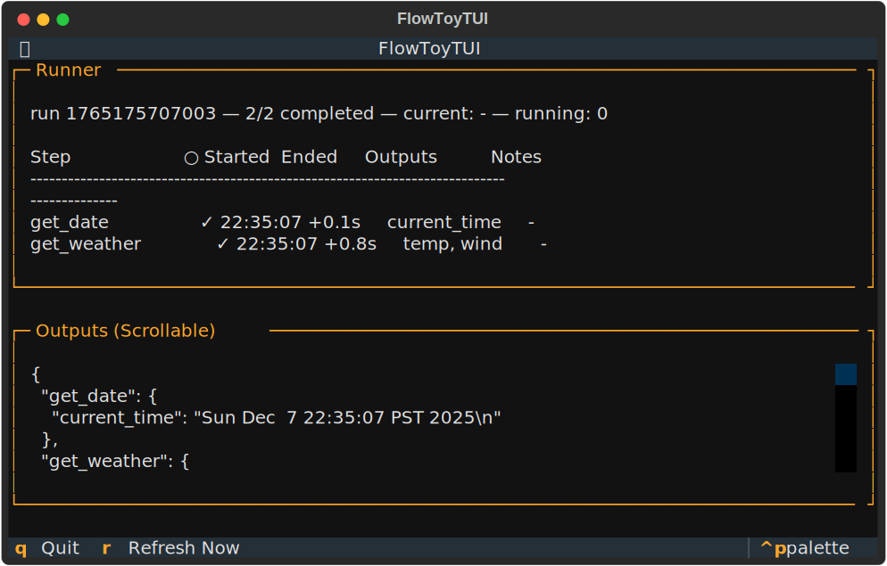
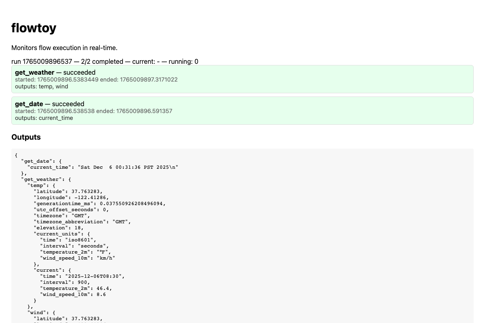

# Monitor Flow Execution

This guide shows how to monitor flow execution using flowtoy's built-in interfaces.

## Example Flow

We'll use this example flow throughout this guide. Save it as `monitor-flow.yaml`:

```{literalinclude} ../how-to-files/monitor-flow.yaml
:language: yaml
```

This flow fetches weather data from a REST API and gets the current time using a shell command.

## Status Server

flowtoy provides a status server that exposes flow execution information via HTTP endpoints. This is the foundation for all monitoring interfaces.

### Running with Status Server

Run your flow with a status server:

```bash
flowtoy run monitor-flow.yaml --status-port 8005
```

This runs the flow and keeps a status server alive on port 8005. The server provides:
- `/status` endpoint - Flow execution status (step states, timing)
- `/outputs` endpoint - Step output values

The flow runs to completion while the status server stays alive for monitoring tools.

## Terminal UI

The terminal UI monitors flow execution in your terminal.

### All-in-One Mode

The simplest way to monitor a flow in the terminal:

```bash
flowtoy tui monitor-flow.yaml
```

This starts a status server internally and displays the TUI. The TUI provides real-time display of flow execution with step status, timing, and output values:



### Monitor External Flows

You can also use the TUI to monitor a flow running elsewhere:

```bash
# Terminal 1: Run flow with status server
flowtoy run monitor-flow.yaml --status-port 8005

# Terminal 2: Monitor it
flowtoy tui --status-url http://127.0.0.1:8005/status
```

This is useful for monitoring remote flows or flows started by other tools.

## Web UI

The web UI monitors flow execution in your browser.

### All-in-One Mode

The simplest way to monitor a flow in the browser:

```bash
flowtoy webui monitor-flow.yaml
```

This starts a status server internally and serves the web UI. By default, it runs on `http://127.0.0.1:8000`. Open this URL in your browser.

Running the example flow displays:



The web UI displays:
- Current step execution status
- Step outputs as they complete
- Error messages and diagnostics
- Overall flow progress

The UI polls `/status` and `/outputs` endpoints automatically.

### Custom Host and Port

```bash
flowtoy webui monitor-flow.yaml --host 0.0.0.0 --port 8080
```

### Monitor External Flows

You can also serve the web UI to monitor a flow running elsewhere:

```bash
# Server: Run flow with status server
flowtoy run monitor-flow.yaml --status-port 8005

# Laptop: Serve UI to monitor it
flowtoy webui --status-url http://server-hostname:8005
```

This is useful for monitoring remote flows or viewing flows from multiple browsers.

## Status API

You can also query the status server programmatically using the API endpoints.

### Using the Serve Command

The `serve` command provides the same status API as `run --status-port`, but without running a flow:

```bash
flowtoy serve monitor-flow.yaml
```

This runs on `http://127.0.0.1:8000` by default.

### Query Flow Status

```bash
curl http://127.0.0.1:8000/status
```

Returns execution status for all steps:
```json
{
  "step_name": {
    "status": "completed",
    "start_time": "2024-01-01T12:00:00",
    "end_time": "2024-01-01T12:00:05"
  }
}
```

### Query Flow Outputs

```bash
curl http://127.0.0.1:8000/outputs
```

Returns output data from completed steps:
```json
{
  "step_name": {
    "field": "value"
  }
}
```

### Custom Host and Port

```bash
flowtoy serve monitor-flow.yaml --host 0.0.0.0 --port 8080
```

## Integrating with External Tools

### Poll Status in Scripts

```bash
#!/bin/bash
flowtoy run monitor-flow.yaml --status-port 8005 &
FLOW_PID=$!

# Wait for completion
while true; do
  STATUS=$(curl -s http://127.0.0.1:8005/status)
  if echo "$STATUS" | grep -q "completed"; then
    break
  fi
  sleep 2
done

# Retrieve outputs
curl http://127.0.0.1:8005/outputs > results.json

# Flow process will exit after completion
wait $FLOW_PID
```

### Use with CI/CD

Run flow with `--status-port` in background, poll status endpoint, retrieve outputs when complete.
